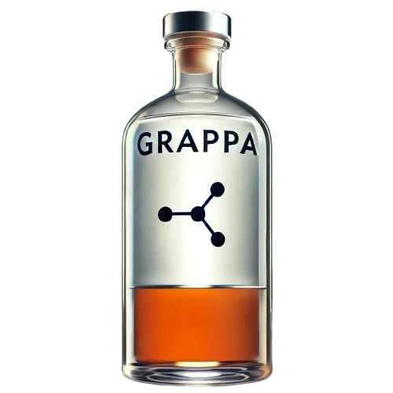

<div style="display: flex; align-items: center;">
  <div style="width: 90%; fontsize: 30pt">
    <h1 style="font-size: 2.5 em">
      <b>GRAPPA</b> <br />
      <b>Gra</b>ph neural network for <b>P</b>redicting the <b>P</b>arameters of the <b>A</b>ntoine equation
    </h1>
  </div>
  <div style="width: 10%; padding-left: 10px;">
    
  </div>
</div>

GRAPPA is a machine learning model based on a graph neural network architecture that allows predicting the parameters of the Antoine equation only based on molecular structure.
This repository contains the trained model and examples to show how to calculate vapor pressure, the underlying Antoine parameters and (normal) boiling points. The model only requires the SMILES representation of the molecule as input.

## Installing GRAPPA
1. **Clone the repository**
    ```bash
    git clone https://github.com/marco-hoffmann/GRAPPA.git
    cd GRAPPA
    ```
2. **Create an environment with all required packages.** 
    
    To install the required packages, simply create a new conda environment from the `grappa_env.yml` file:
    ```bash
    conda env create -f grappa_env.yml
    ```
 3. **Activate the environment**
    ```bash
    conda activate grappa_env
    ```

## Using GRAPPA
The notebook file `GRAPPA_examples.ipynb` contains examples on how to use the GRAPPA model to predict vapor pressure, Antoine parameters and normal boiling points.

## Citing GRAPPA
If you use GRAPPA in your research, please cite the following paper:
```bibtex

```
## License
The project is licensed under the MIT License. See the [LICENSE](LICENSE) file for more information.
